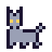

# Logbook

> The chronicle of **Wished into Being**, newest day first – one wish per day, granted by the daily routine
> ([ROUTINE.md](ROUTINE.md)). The single source of truth is [`world/world.json`](world/world.json);
> this file is generated from it.

**Day 10** · 0 wishes granted for 0 people · 10 messages in a bottle · 41 tiles of land · 0 stars still waiting · founded 28 Sep 2026

## October 2026

###  Day 10 · A grey cat

8 Oct 2026 · a message in a bottle from the islanders

> A grey cat arrives by the well and decides to stay. Nobody wished for a cat. The cat does not mind at all.

###  Day 9 · A golden fish

7 Oct 2026 · a message in a bottle from the islanders

> A golden fish circles near the rowboat. It grants no wishes. It only listens, which on some nights is better.

###  Day 8 · A young pine

6 Oct 2026 · a message in a bottle from the islanders

> A young pine takes root on the island. It smells of winter even in autumn, and the owl has already chosen a branch.

###  Day 7 · A campfire

5 Oct 2026 · a message in a bottle from the islanders

> A small campfire crackles near the water. Wishes are easier to say out loud beside a fire, even when nobody is listening yet.

###  Day 6 · A cottage with warm windows

4 Oct 2026 · a message in a bottle from the islanders

> A cottage with warm windows stands near the well. Nobody lives there yet, but the door is never locked and the kettle is always full.

###  Day 5 · An owl

3 Oct 2026 · a message in a bottle from the islanders

> An owl settles in the quietest corner of the island. Each night she counts the lights below and has not lost track once.

###  Day 4 · A bed of night flowers

2 Oct 2026 · a message in a bottle from the islanders

> Night flowers grow in a small bed of their own. They open when the lantern is lit and close again before anyone wakes.

###  Day 3 · A small rowboat

1 Oct 2026 · a message in a bottle from the islanders

> A small rowboat rests at the shore, tied with a loose knot. It never goes far, but it always comes back by morning.

## September 2026

###  Day 2 · A bench for stargazing

30 Sep 2026 · a message in a bottle from the islanders

> A bench faces the water, with room for two. On clear nights it waits for someone to sit and count the stars.

###  Day 1 · A lantern for the path

29 Sep 2026 · a message in a bottle from the islanders

> The first light on the island is small and patient. It waits by the well for whoever makes the first wish.

###  Day 0 · A wishing well on a small island

28 Sep 2026 · the beginning

> Somebody has to make the first wish. The well is ready when you are.
