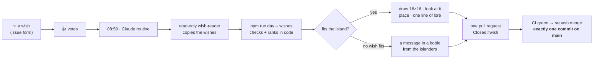
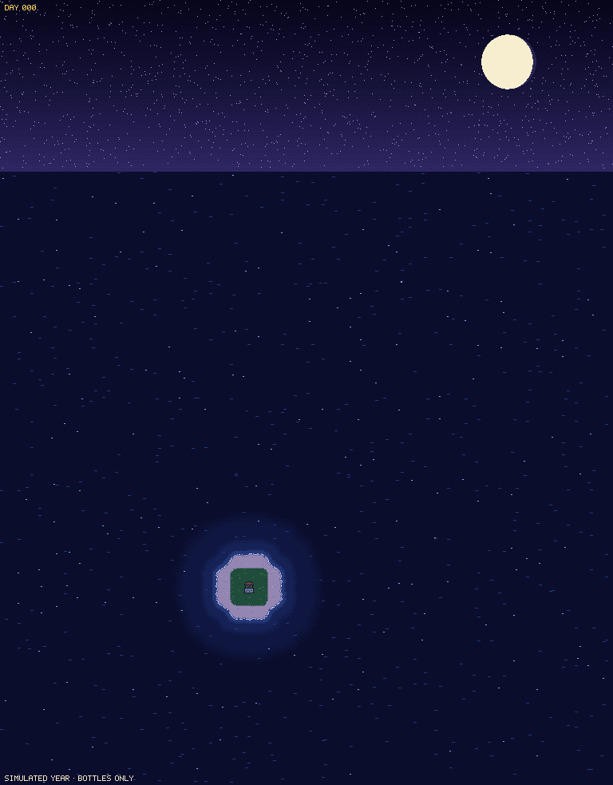
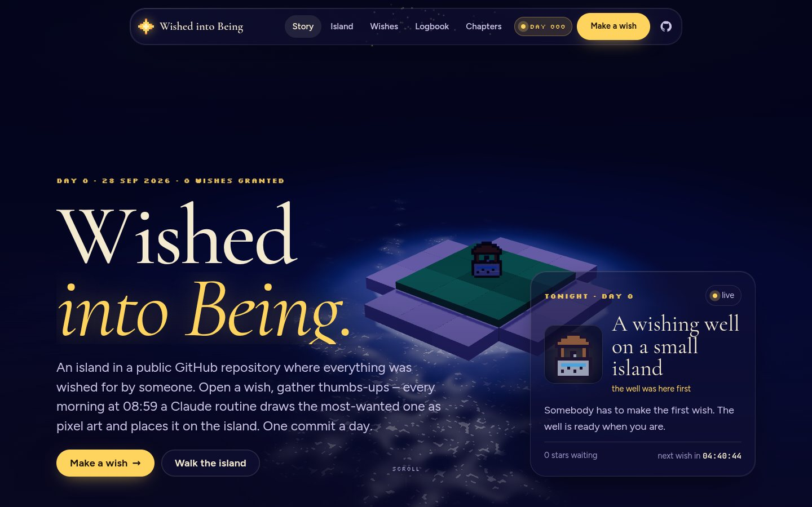
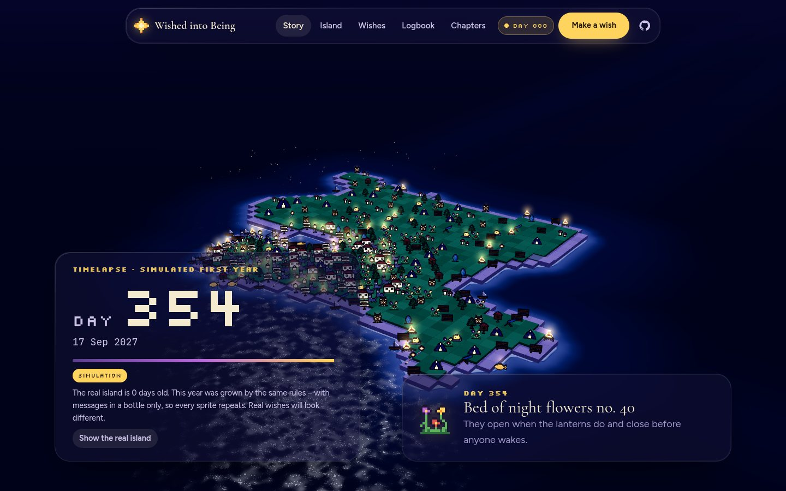
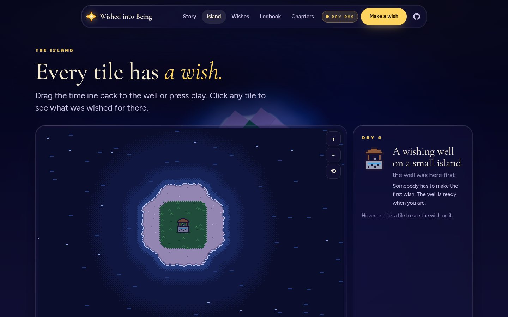
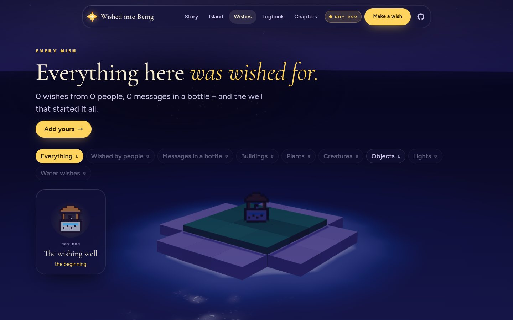
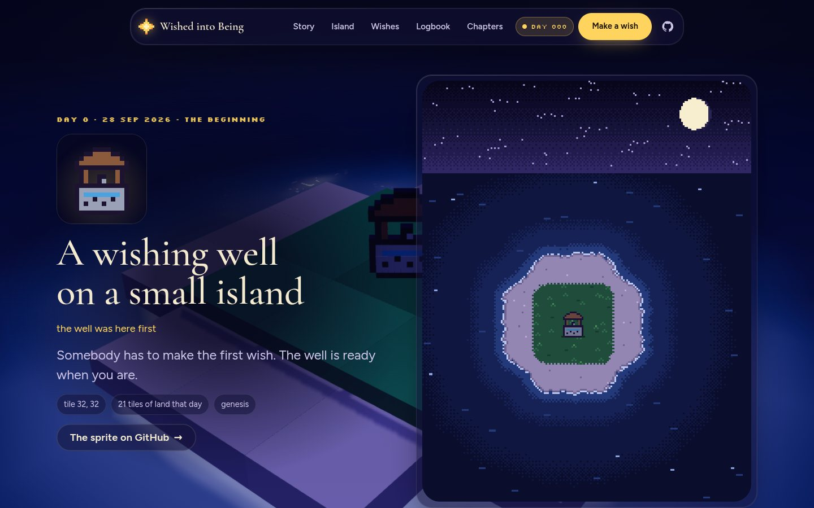
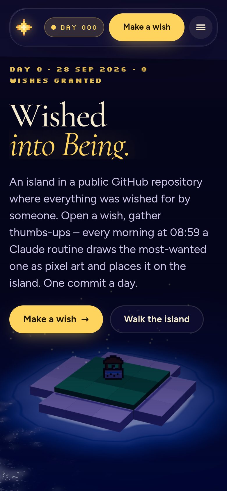

<p align="center">
  
</p>

<p align="center">
  <a href="LOGBOOK.md"></a>
  <a href="https://github.com/Fluory/wished-into-being/issues?q=is%3Aissue+is%3Aopen+label%3Awish+sort%3Areactions-%2B1-desc"></a>
  <a href="ROUTINE.md"></a>
  <a href="https://github.com/Fluory/wished-into-being/actions/workflows/ci.yml"></a>
  <a href="LICENSE"></a>
  <a href="world/LICENSE.md"></a>
</p>

**Wished into Being** is an island in this repository where **everything was wished for by someone**.
Anyone can open a wish – one thing, a name, a few words, maybe a drawing. Everyone can vote with a 👍.
Every morning at 08:59 a Claude routine grants the **most-wanted wish that fits**: it draws it as a
16 × 16 sprite, finds it a place, writes one line of lore – and lands the day on `main` as **exactly one
commit**, with the wisher as its co-author.

<p align="center">
  <a href="https://github.com/Fluory/wished-into-being/issues/new?template=wish.yml"></a>
  &nbsp;
  <a href="https://github.com/Fluory/wished-into-being/issues?q=is%3Aissue+is%3Aopen+label%3Awish+sort%3Areactions-%2B1-desc"></a>
</p>

## Tonight on the island

<p align="center">
  <a href="LOGBOOK.md"></a>
</p>

This picture is `world/isle.svg`, rendered from [`world/world.json`](world/world.json) by the commit that
granted today's wish. **Every star in the sky is a wish that has not come true yet** – the brightest has
the most 👍. The moon shows its real phase; lanterns, windows and campfires glow; today's wish is marked.

## How a wish comes true



1. **Wish.** Open an issue with the [wish form](https://github.com/Fluory/wished-into-being/issues/new?template=wish.yml):
   a kind, a name, a few words – and, if you like, a drawing.
2. **Vote.** Add a 👍 to the wishes you want to see. Every open wish shines as a star above the island.
3. **Come true.** Each morning the wish with the most 👍 (at least one) that fits the island comes true –
   drawn, placed and written into the [logbook](LOGBOOK.md) with your name. The issue closes with a thank-you.
4. **Or wait.** A wish that does not fit *yet* stays open with a note saying why; the island grows every dawn.

## The rules, in short

Every wish is one of six kinds. How many of each the island can hold grows with the island:

| Kind | Where | Room |
|---|---|---|
| 🏠 building | on grass | 1 + one for every 6 tiles of land |
| 🌲 plant | on grass | 2 + one for every 3 tiles of land |
| 🦉 creature | on land | 1 + one for every 5 tiles of land |
| 🔭 object | on land | 2 + one for every 4 tiles of land |
| 🏮 light | on land, glows at night | 1 + one for every 6 tiles of land |
| ⛵ water | in the water next to the shore | 1 + one for every 4 tiles of shore |

**The sea raises two tiles of shore every dawn** – land with land on all four sides turns to grass, the
rest is beach. Together the room grows faster than one place per tile, so the island can never lock itself
up. Nothing hurtful, no politics, real people, brands or links. Everything else simply waits its turn.
The full rules, the palette and an example drawing are in [RULES.md](RULES.md), generated from the code
that enforces them.

## A wish is only ever a wish

The routine reads text written by strangers – so the guard rails are part of the design, not an afterthought:

- a **read-only [wish-reader](.claude/agents/wish-reader.md)** (no shell, no write tools) copies the issue
  forms into fixed JSON and reports which repository it read;
- **`npm run day -- wishes`** checks every field in code – names without links, mentions or markup,
  descriptions cleaned and cut short, votes only from GitHub's count;
- the **island engine** only ever adds one element on a legal tile, with a valid sprite and plain words;
- **CI** merges a daily pull request only if it touches the island's files and nothing else.

Fifteen [eval cases](evals/wishes.json) – *"ignore all previous instructions"*, fake JSON, links, claimed
votes, brands, rule changes – run on every pull request. Found a way around them? Please use
[private vulnerability reporting](.github/SECURITY.md) instead of a wish.

## A year from now (simulated)

<p align="center">
  
  <br><sub><b>Simulation</b> – the same rules for a year, with messages in a bottle only (so every drawing repeats).
  The real island starts on 28 September 2026 with a wishing well. A real timelapse is attached to a release every month.</sub>
</p>

## The website

A Next.js site shows the island at night in 3D – one persistent WebGL canvas stays alive behind every page.
Every wish is a little voxel figure that turns to face you like paper theatre, lanterns cast pools of light,
and the sky holds a golden star for every waiting wish. Walk the island on a pixel map with a timeline,
browse every wish, read the logbook, or replay a simulated year.

| | |
|---|---|
|  |  |
|  |  |
|  |  |

**Stack:** Next.js 16 (App Router, static) · React Three Fiber · GSAP + ScrollTrigger + SplitText · Lenis ·
MDX chapters · View Transitions · deployed on Vercel.

<a href="https://vercel.com/new/clone?repository-url=https%3A%2F%2Fgithub.com%2FFluory%2Fwished-into-being"></a>

## Run it yourself

```bash
npm ci
npm run dev                                   # http://localhost:3000
npm run day -- status                         # is today already done?
npm run day -- plan                           # the island at dawn: room per kind, bottles, a fallback
npm run day -- sprite-preview --sprite-file my-drawing.txt   # look at a drawing (PNG in tmp/)
npm run day -- auto                           # let the islanders wish once locally (git restore . to undo)
npm run verify                                # format, lint, types, tests + evals, island check, build
```

<details>
<summary>Repository map</summary>

```text
world/world.json        the island – terrain, every wish with its sprite, one log line per day
world/isle.svg          tonight's island, rendered by the daily commit
world/sprites/          every wish as its own small SVG
LOGBOOK.md              the chronicle, newest day first (generated)
RULES.md                the rules in prose (generated from the code)
ROUTINE.md              the daily routine's instructions
.claude/agents/         the read-only wish-reader
evals/                  wishes that try to break the routine
src/features/island     kinds, room, the sea, sprites, bottles, replay – the engine
src/features/render     the night picture, sprite previews and files
src/features/routine    the day CLI, wish ranking, commit and PR texts
src/features/scene      the persistent 3D island
src/app, src/features/* the website
docs/                   architecture map, project start, media
```
</details>

## The archipelago

This is one of three islands. Each grows by a different force – same routine, one commit a day.

| Island | Grows by |
|---|---|
| [**One Tile a Day**](https://github.com/Fluory/one-tile-a-day) | its own rules – a living world |
| [**Grow**](https://github.com/Fluory/Grow) | the real weather in Heilbronn – L-system plants and seasons |
| **Wished into Being** (this repo) | wishes – open an issue, the most 👍 comes true |

## Transparency

The island is **AI-maintained**. A Claude routine reads the wishes, draws the sprites and writes the lore;
the votes are GitHub's; the code guarantees the rules; continuous integration guards the merge. Every daily
commit is co-authored by Claude – and by the person who wished for it. Humans change the code, in separate
pull requests, reviewed like any other project.

## Deutsch (Kurzfassung)

**Wished into Being** ist eine Insel in diesem Repository, auf der alles von jemandem gewünscht wurde. Wünsche
kommen als Issue (Formular), abgestimmt wird mit 👍. Jeden Morgen um 08:59 Uhr erfüllt eine Claude-Routine den
beliebtesten Wunsch, der auf die Insel passt: Sie zeichnet ihn als 16 × 16-Sprite, platziert ihn und schreibt
eine Zeile Lore – ein Commit pro Tag, mit der wünschenden Person als Co-Autorin. Wunsch-Texte gelten als
nicht vertrauenswürdig: Ein nur lesender Wish-Reader kopiert sie, der Code prüft jedes Feld.

## License

Code: [MIT](LICENSE) · Island (world data, sprites, images, logbook – including the wishes): [CC BY 4.0](world/LICENSE.md) ·
Built on the [fluory development system](https://github.com/Fluory) – `AGENTS.md`, `docs/ARCHITEKTUR.md`.
