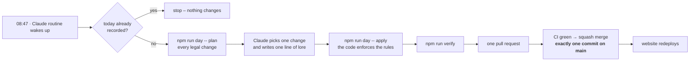

<p align="center">
  
</p>

<p align="center">
  <a href="LOGBOOK.md"></a>
  <a href="ROUTINE.md"></a>
  <a href="https://github.com/Fluory/one-tile-a-day/actions/workflows/ci.yml"></a>
  <a href="LICENSE"></a>
  <a href="world/LICENSE.md"></a>
</p>

**One Tile a Day** is a pixel island that lives in this repository and grows by **exactly one tile per
day**. Every morning at 08:47 (Heilbronn time) a Claude routine reads the island, picks one change the
[world rules](RULES.md) allow, writes one line of lore and lands it on `main` as **exactly one commit**.
After a year there are 365 commits for 365 visible changes – and the commit history reads like a chronicle.

## Today on the island

<p align="center">
  <a href="LOGBOOK.md"></a>
</p>

This image is `world/isle.svg`. It is rendered from [`world/world.json`](world/world.json) by the same
commit that changes the island, so it is always today's island. The newest tile blinks.

## How a day happens



- **Idempotent** – if the routine runs twice, the second run finds today already recorded.
- **Rule-bound** – the routine can only choose among changes the code allows. A house needs land
  around it, a harbour needs a coast and three houses, the library waits for three houses.
- **Open** – the routine's instructions are a file: [ROUTINE.md](ROUTINE.md). The guard rails are
  tested ([evals](evals/README.md)); the only files a daily pull request may touch are
  `world/world.json`, `world/isle.svg` and `LOGBOOK.md`.
- **Readable history** – `git log --oneline` looks like `Day 42: Lighthouse on the eastern rocks`.

## Watch it grow

<p align="center">
  
  <br><sub><b>Simulation</b> – what the same rules build in a year, grown by the rule-based director.
  The real island starts from a sandbank on 28 September 2026 and fills in day by day.
  A real timelapse is attached to a release every month.</sub>
</p>

## The website

A Next.js site shows the island in 3D – one persistent WebGL canvas stays alive behind every page while
you scroll through a timelapse, read the logbook or open a chapter. Day or night: at night the
lighthouse turns on.

| | |
|---|---|
|  |  |
|  |  |

**Stack:** Next.js 16 (App Router, static) · React Three Fiber · GSAP + ScrollTrigger + SplitText ·
Lenis · MDX chapters · View Transitions · CSS for glass, grain and grass · deployed on Vercel.

<a href="https://vercel.com/new/clone?repository-url=https%3A%2F%2Fgithub.com%2FFluory%2Fone-tile-a-day"></a>

## Run it yourself

```bash
npm ci
npm run dev                      # http://localhost:3000
npm run day -- status            # is today already done?
npm run day -- plan              # what the routine sees: every legal change + a suggestion
npm run day -- auto --date 2026-09-29   # let the director grow one day locally (git restore . to undo)
npm run verify                   # format, lint, types, tests, world check, build
```

<details>
<summary>Repository map</summary>

```text
world/world.json        the island – single source of truth (terrain as ASCII rows)
world/isle.svg          today's island, rendered by the daily commit
LOGBOOK.md              the chronicle, newest day first (generated)
RULES.md                the world rules in prose (generated from the code)
ROUTINE.md              the daily routine's instructions
src/features/world      rules, director, apply, history – the engine
src/features/render     pixel renderer, palettes, sprites, SVG export
src/features/routine    the day CLI used by the routine
src/features/scene      the persistent 3D canvas
src/app, src/features/* the website
docs/                   architecture map, project start, media
```
</details>

## The archipelago

This is one of three islands. Each grows by a different force – same routine, one commit a day.

| Island | Grows by |
|---|---|
| **One Tile a Day** (this repo) | its own rules – a living world |
| [**Grow**](https://github.com/Fluory/Grow) | the real weather in Heilbronn – L-system plants and seasons |
| [**Wished into Being**](https://github.com/Fluory/wished-into-being) | wishes – open an issue, the most 👍 gets built |

## Transparency

The island is **AI-maintained**. A Claude routine chooses the daily change and writes the lore; the code
guarantees the rules; continuous integration guards the merge. Every daily commit is co-authored by
Claude. Humans change the code – in separate pull requests, reviewed like any other project.

## Deutsch (Kurzfassung)

**One Tile a Day** ist eine Pixel-Insel in diesem Repository, die jeden Tag um genau ein Feld wächst.
Jeden Morgen um 08:47 Uhr wählt eine Claude-Routine eine Änderung, die die Weltregeln erlauben,
schreibt eine Zeile Lore und bringt sie als genau einen Commit auf `main`. Die Website zeigt die Insel
in 3D, als Karte mit Zeitleiste und im Logbuch.

## License

Code: [MIT](LICENSE) · Island (world data, images, logbook): [CC BY 4.0](world/LICENSE.md) ·
Built on the [fluory development system](https://github.com/Fluory) – `AGENTS.md`, `docs/ARCHITEKTUR.md`.
