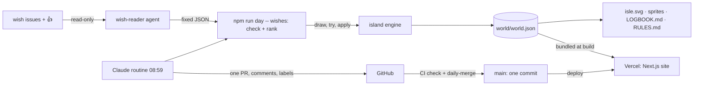

# Architecture – Wished into Being

> Living document: whoever changes the structure changes this file **in the same PR**.
> Altitude: modules/folders, not single files. Current state – plans belong in specs.

## Summary

`world/world.json` is the single source of truth. Wishes arrive as GitHub issues (an issue form); a read-only
**wish-reader** agent copies their fields, and the **routine toolbox** (`npm run day`) checks and ranks them in
code. A pure TypeScript **island engine** lets the sea raise shore every dawn and grants exactly one wish (or a
message in a bottle) per day; a **renderer** turns the island into a night picture (`world/isle.svg`) and every
wish into a sprite file; generators write `LOGBOOK.md` and `RULES.md`. A scheduled **Claude routine** drives it
all and opens one pull request per day, which CI merges with squash. A **Next.js website** shows the same island
in 3D (one persistent React Three Fiber canvas), as a pixel map with timeline, and as a gallery of wishes.

## Modules

| Module | Location | Responsibility | Depends on |
|---|---|---|---|
| island | `src/features/island/` | model + zod schema, sprite palette and checks, map, rules (kinds, room, tiles, the sea), apply/dawn, director (bottles), catalogue, history/`worldAt`, stats | zod |
| render | `src/features/render/` | pixel canvas, terrain, night sky with moon phase and wish-stars, painter, SVG with embedded PNG layers, sprite previews and sprite files, pixel font | island, fflate |
| logbook | `src/features/logbook/` | generated `LOGBOOK.md` and `RULES.md` | island, shared/repo |
| routine | `src/features/routine/` | day CLI (`npm run day`), wish ranking from the wish-reader, file IO, serialisation, commit/PR texts, issue comments | island, render, logbook, resvg |
| world-data | `src/features/world-data/` | build-time access to `world.json`, simulated year, site constants | island |
| scene | `src/features/scene/` | the persistent 3D canvas: tiles, voxel wishes, glows, night sea, sky, fireflies, camera rig, store | island, render (palette, moon), three, R3F |
| story | `src/features/story/` | home page sections and their scroll choreography of the scene | scene, sprites, chapters, motion |
| map | `src/features/map/` | pixel map explorer with timeline | render, scene, sprites, story |
| gallery | `src/features/gallery/` | the filterable wall of every wish | island, sprites |
| sprites | `src/features/sprites/` | sprites as crisp inline SVG, interface icons in the sprite palette | island |
| chapters | `src/features/chapters/` + `src/content/chapters/` | MDX case studies, cards, MDX components | render, island, world-data, sprites |
| chrome | `src/features/chrome/` | header, footer, countdown to 08:59 | sprites |
| legal | `src/features/legal/` | imprint data from environment variables | – |
| media | `src/features/media/` | README banner, social preview, timelapse GIF (`npm run media`, monthly release workflow) | render, island, world-data, resvg, gifenc |
| wish-reader | `.claude/agents/wish-reader.md` | read-only scout that copies open wish issues into fixed JSON | GitHub MCP (read tools only) |
| evals | `evals/` + `src/features/routine/evals.test.ts` | prompt-injection and moderation cases for the routine | routine |
| e2e | `e2e/` | Playwright smoke flows for `verify:full` | @playwright/test |
| shared | `src/shared/` | motion (Lenis, SplitText, reveal) and repository links | gsap, lenis |
| app | `src/app/` | routes, layout, metadata, static JSON routes, OG image | all of the above |

Other modules import only through each module's `index.ts`.

## Data

| Data | Class | Where | Purpose, retention |
|---|---|---|---|
| The island: terrain, elements, sprites, lore | public | `world/`, `LOGBOOK.md` | the artwork; permanent (git history) |
| Wisher's GitHub login and user id, issue number, votes | personal (public on GitHub, consent in the wish form) | `world.json`, logbook, commit co-author trailer, website | credit for a granted wish; permanent in the public chronicle – removal from current files on request (privacy text §4) |
| Open wishes (issue text) | public, **untrusted** | GitHub issues only – read by the wish-reader at run time, never stored | choosing the day's wish; only the checked fields of a granted wish are kept |
| Hosting logs | personal | Vercel | delivery of the site; Vercel's retention |

No secrets, no accounts, no database. The routine sends public wish text to the Claude API; nothing confidential
ever enters a prompt.

## Exception register

Consciously accepted deviations – without an entry here a deviation is an error.

| Exception | Why accepted | Owner | Review |
|---|---|---|---|
| The routine's **daily world PR is merged automatically** (job `daily-merge` in `ci.yml`, squash, GITHUB_TOKEN) – author and merger are both automation. | The product *is* one wish per day; a human merge every morning would break it. The job only merges same-repo `claude/*` PRs titled `Day N: …` with exactly one commit that touch only `world/world.json`, `world/isle.svg`, `world/sprites/w<n>.svg` and `LOGBOOK.md`, after the full `check` job is green. Profile: `p0_self_merge_exception` for exactly this case. | @Fluory | 2026-12-28 |
| **PR guard skipped for fork PRs.** | Outside contributors cannot fill the maintainers' German PR template; maintainers complete it before merging (CONTRIBUTING.md). | @Fluory | 2026-12-28 |
| **React-Compiler lint rules `immutability`/`refs` off in `src/features/scene/`.** | react-three-fiber mutates materials and instance buffers per frame by design; the compiler is not used. | @Fluory | at compiler adoption |

## Data flow

## External services

- **GitHub** – repository, issues (wishes), Actions (CI, label sync, monthly timelapse release), pull requests.
- **Vercel** – static hosting of the website (Hobby). Imprint data as environment variables.
- **Claude routine** (Claude Code in the cloud) – runs `ROUTINE.md` daily at 08:59 Europe/Berlin.
- Sister islands (`Fluory/one-tile-a-day`, `Fluory/Grow`) – their README images are fetched server-side at build time (ISR, 6 h) and inlined.

## Decisions (mini ADRs)

### ADR-1 · 2026-09-28 · One Next.js app at the repository root

- **Decision:** engine, CLI and website share one package at the root (`src/features/…`).
- **Why:** one language, one `verify`, zero-config Vercel import; the engine is imported by the site at build time.
- **Rejected:** npm workspaces (`engine/` + `web/`) – more config for no second consumer yet.

### ADR-2 · 2026-09-28 · Daily change via pull request + CI squash merge

- **Decision:** the routine never writes `main`; it opens one PR, CI verifies and squash-merges it; `Closes #n` closes the granted wish.
- **Why:** keeps "main only via PR" and the push guard intact, gives every day a reviewable record and still yields exactly one commit on `main`.
- **Rejected:** direct pushes to `main` (blocked by `guard-git.sh`, no gate); GitHub Actions granting wishes without the routine (no drawing, no judgement).

### ADR-3 · 2026-09-28 · world.json: terrain as rows, one element or day per line, sprites inline

- **Decision:** terrain is 64 strings; every element carries its 16-line sprite; every element and day entry is one line.
- **Why:** a daily diff is a few map characters (the new shore), one element line and one log line – the commit shows exactly what came true.
- **Rejected:** sprites as separate source files (two sources of truth), a binary store.

### ADR-4 · 2026-09-28 · Wishes through issue forms, a read-only reader and code checks

- **Decision:** wishes are GitHub issues with a form; the `wish-reader` agent (read-only GitHub tools, no shell) copies the fields into fixed JSON; `npm run day -- wishes` validates, cleans and ranks them in code; the routine only judges and draws.
- **Why:** issue text is untrusted – a wish must never be able to instruct the agent. The layers (reader without write tools, schema and text checks in code, the engine's rules, CI merging only world files) keep a wish a wish.
- **Rejected:** the routine reading issues itself (injection straight into the acting context); fetching issues from the GitHub API in code (the shared cloud IP runs into the unauthenticated rate limit).

### ADR-5 · 2026-09-28 · The README picture embeds its still layers as PNG

- **Decision:** `isle.svg` stays one SVG, but ground, sprites and glow are embedded as indexed PNG (pure-JS deflate, `fflate`); waves, twinkling stars and today's marker stay vector with CSS animation.
- **Why:** a year-old island as vector runs weighed 2.5 MB; with PNG layers it is about 100 KB – still one deterministic file, still animated on GitHub.
- **Rejected:** a plain PNG (no animation), fewer pixels (sprites need 16 × 16), `node:zlib` (output may differ between machines, the byte-exact world check would flap).

### ADR-6 · 2026-09-28 · The sea raises two tiles every dawn; terrain follows from the land

- **Decision:** before every day's wish the sea raises two free shore tiles (a fixed field per island shapes capes and bays, never next to a water wish); grass and sand are derived from the land; room per kind grows by more than one place per tile in total.
- **Why:** growth that only happened when a wish found no tile locked the island up after a few months; with steady growth some kind always has room and half of the island stays open.
- **Rejected:** one tile per day (a packed inventory grid), growth on demand (deadlock), stored grass/sand choices (history would need more rules).
