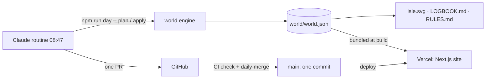

# Architecture – One Tile a Day

> Living document: whoever changes the structure changes this file **in the same PR**.
> Altitude: modules/folders, not single files. Current state – plans belong in specs.

## Summary

`world/world.json` is the single source of truth. A pure TypeScript **world engine** applies exactly
one rule-checked change per day; a **renderer** turns the world into pixel art (`world/isle.svg`);
generators write `LOGBOOK.md` and `RULES.md`. A scheduled **Claude routine** drives the engine through
a CLI and opens one pull request per day, which CI merges with squash. A **Next.js website** renders
the same world in 3D (one persistent React Three Fiber canvas) and as an interactive pixel map.

## Modules

| Module | Location | Responsibility | Depends on |
|---|---|---|---|
| world | `src/features/world/` | model + zod schema, rules, catalogue, director, apply, history/`worldAt`, stats | zod |
| render | `src/features/render/` | pixel canvas, terrain + sprites, palettes, SVG export, pixel font, icons | world |
| logbook | `src/features/logbook/` | generated `LOGBOOK.md` and `RULES.md` | world |
| routine | `src/features/routine/` | day CLI (`npm run day`), file IO, serialisation, PR body | world, render, logbook |
| world-data | `src/features/world-data/` | build-time access to `world.json`, simulation, site constants | world |
| scene | `src/features/scene/` | the persistent 3D canvas: terrain, blocks, sea shader, sky, camera rig, store | world, render (palettes), three, R3F |
| story | `src/features/story/` | home page sections, scroll choreography of the scene | scene, chapters, motion, ui |
| map | `src/features/map/` | pixel map explorer with timeline | render, scene |
| chapters | `src/features/chapters/` + `src/content/chapters/` | MDX case studies, cards, MDX components | render, world-data |
| chrome | `src/features/chrome/` | header, footer, theme toggle, countdown | scene |
| legal | `src/features/legal/` | imprint data from environment variables | – |
| media | `src/features/media/` | README banner, social preview, timelapse GIF (`npm run media`, monthly release workflow) | render, world-data, resvg, gifenc |
| e2e | `e2e/` | Playwright smoke flows for `verify:full` | @playwright/test |
| shared/ui, shared/motion | `src/shared/` | design primitives (grass, pixel icons) and motion (Lenis, SplitText, reveal) | gsap, lenis |
| app | `src/app/` | routes, layout, metadata, static JSON routes, OG image | all of the above |

Other modules import only through each module's `index.ts`.

## Exception register

Consciously accepted deviations – without an entry here a deviation is an error.

| Exception | Why accepted | Owner | Review |
|---|---|---|---|
| The routine's **daily world PR is merged automatically** (job `daily-merge` in `ci.yml`, squash, GITHUB_TOKEN) – author and merger are both automation. | The product *is* one commit per day; a human merge every morning would break it. The job only merges same-repo `claude/*` PRs titled `Day N: …` with exactly one commit that touch only `world/world.json`, `world/isle.svg`, `LOGBOOK.md`, after the full `check` job is green. Profile: `p0_self_merge_exception` for exactly this case. | @Fluory | 2026-12-28 |
| **PR guard skipped for fork PRs.** | Outside contributors cannot fill the maintainers' German PR template; maintainers complete it before merging (CONTRIBUTING.md). | @Fluory | 2026-12-28 |
| **React-Compiler lint rules `immutability`/`refs` off in `src/features/scene/`.** | react-three-fiber mutates materials and instance buffers per frame by design; the compiler is not used. | @Fluory | at compiler adoption |

## Data flow

## External services

- **GitHub** – repository, Actions (CI, label sync), pull requests.
- **Vercel** – static hosting of the website (Hobby). Imprint data as environment variables.
- **Claude routine** (Claude Code in the cloud) – runs `ROUTINE.md` daily at 08:47 Europe/Berlin.
- Sister islands (`Fluory/Grow`, `Fluory/wished-into-being`) – their README images are fetched server-side at build time (ISR, 6 h) and inlined.

## Decisions (mini ADRs)

### ADR-1 · 2026-09-28 · One Next.js app at the repository root

- **Decision:** engine, CLI and website share one package at the root (`src/features/…`).
- **Why:** one language, one `verify`, zero-config Vercel import; the engine is imported by the site at build time.
- **Rejected:** npm workspaces (`engine/` + `web/`) – more config for no second consumer yet.

### ADR-2 · 2026-09-28 · Daily change via pull request + CI squash merge

- **Decision:** the routine never writes `main`; it opens one PR, CI verifies and squash-merges it.
- **Why:** keeps the fluory-system rule "main only via PR" and the push guard intact, gives every day a reviewable record and still yields exactly one commit on `main`.
- **Rejected:** direct pushes to `main` (blocked by `guard-git.sh`, no gate); GitHub Actions writing the world itself (the user wanted a Claude routine).

### ADR-3 · 2026-09-28 · Terrain as ASCII rows, one element/day per line

- **Decision:** `world.json` stores terrain as 64 strings and every element/day entry on one line.
- **Why:** a daily diff is one changed map character or one new line – the commit shows exactly one change.
- **Rejected:** a 2D number array (unreadable diffs), SQLite (binary, no diff).
